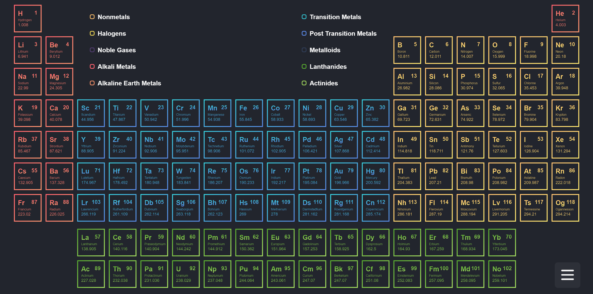
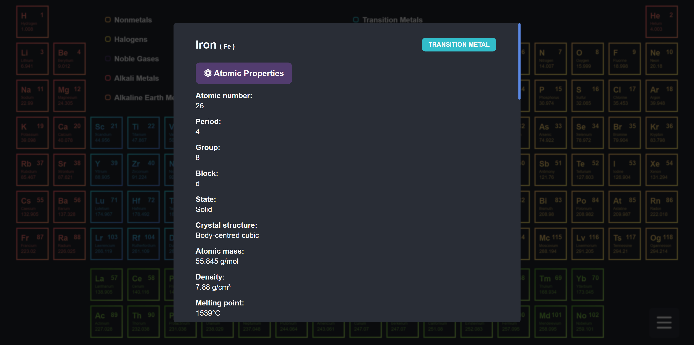
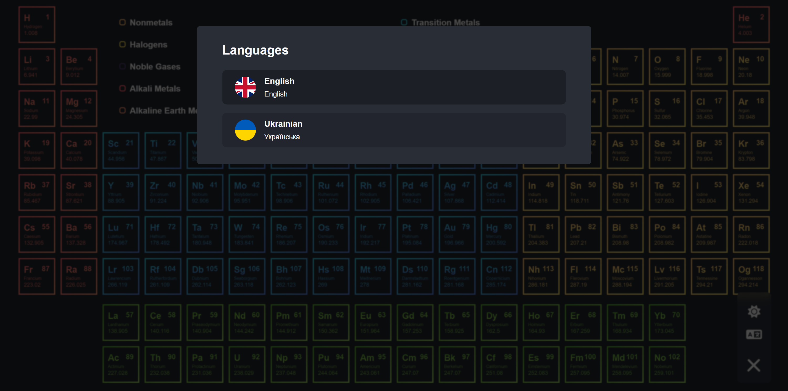
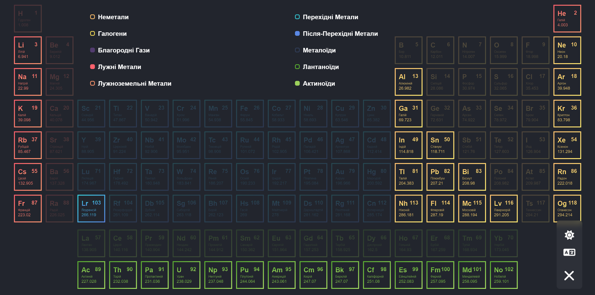
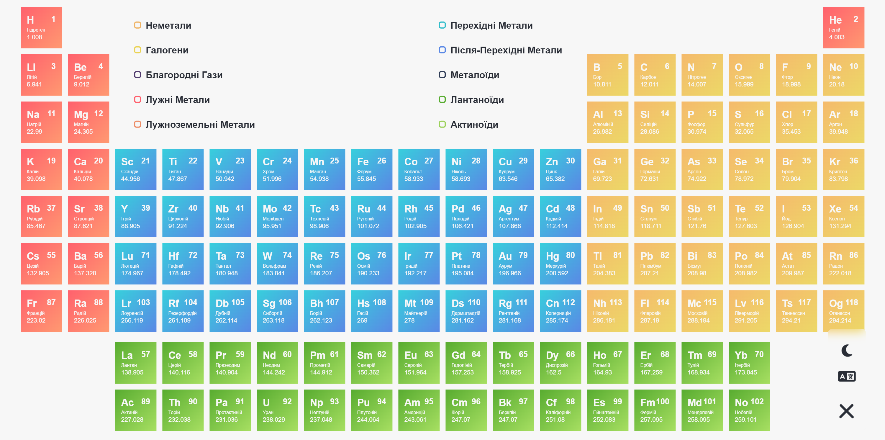
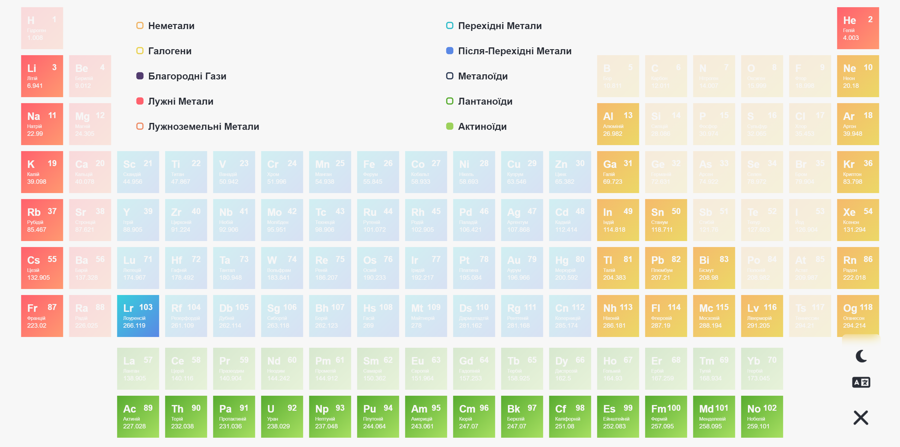
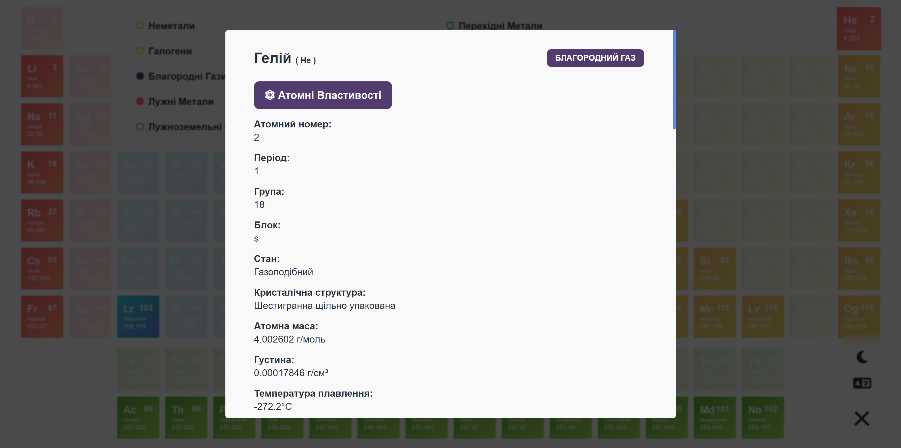
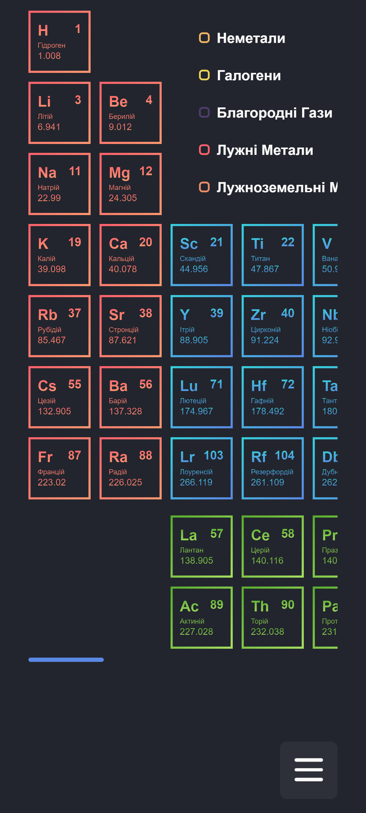
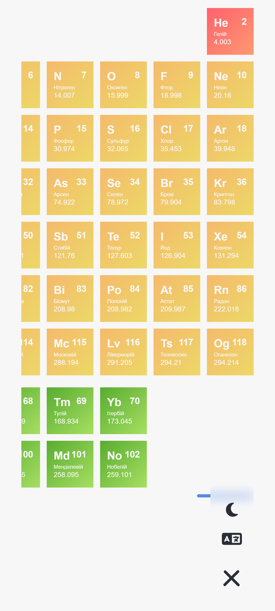
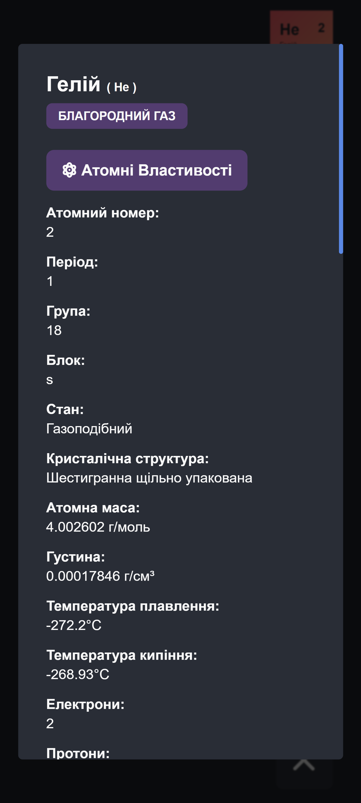

# Periodicum

This is an interactive periodic table application. In it you can click on elements to obtain detailed information about each element. It features dark and light modes and supports both English and Ukrainian languages.

### [Live App](https://periodicum.pages.dev/)

## Table of contents

- [Periodicum](#periodicum)
    - [Live App](#live-app)
  - [Table of contents](#table-of-contents)
  - [Overview](#overview)
    - [Demo](#demo)
    - [Features](#features)
    - [Technologies Used](#technologies-used)
    - [Screenshots](#screenshots)
  - [Author](#author)

## Overview

### Demo

### Features

-   Interactive periodic table with clickable elements
-   Detailed information about each element
-   Dark and light modes for different visual preferences
-   English and Ukrainian language support

### Technologies Used

-   React: JavaScript library for building user interfaces
-   SCSS modules: CSS preprocessor for styling
-   i18next: Internationalization framework for multi-language support

### Screenshots

## Author

-   GitHub - [@Dunkelhaiser](https://github.com/Dunkelhaiser)
